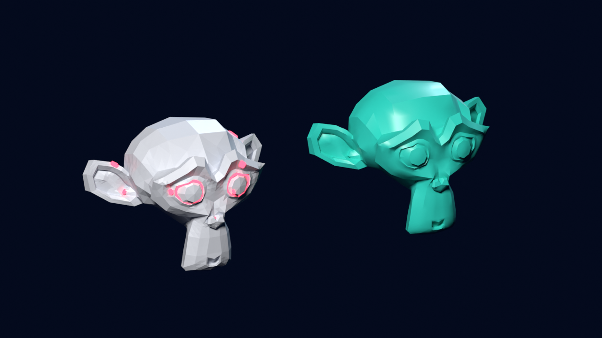

# Print Fix

A Blender add-on that finds what would stop a model printing, repairs a **copy**, and checks the copy again before it calls it printable.

**Get it:** https://croucamp.gumroad.com/l/print-fix ($15, 30-day refund, includes a guide and a damaged 300 mm sample model)

## What it checks
Open edges (holes), non-manifold edges, flipped faces, inside-out solids, solids buried inside solids, faces that pass through each other, models with no volume, loose parts, duplicate vertices, and the thinnest wall.

## What it does
Repairs a copy from gentlest to most drastic: remove loose parts, weld, fix face direction, remove fins, fill holes, drop buried solids, exact boolean union of intersecting shells, and (only if allowed) a voxel rebuild. It stops at the first step that gives a printable mesh. The original is hidden, never changed, and a real cavity inside a hollow model is kept.

## Measured results
- Sample: a 300 mm Suzanne with **110 open edges, 1 non-manifold edge, 32 flipped-face edges, 163 intersecting faces** becomes "no problems found" in about a second; volume within 0.04% of the same model undamaged.
- 600,000 faces with holes repaired in about 20 seconds.
- 28 automated tests plus a full buyer-path test on **Blender 4.2.9 LTS and 5.1.2**.

## Honest limits
Holes are filled with flat triangles (watertight, not sculpted). Thin walls are reported, not fixed. The voxel rebuild is a last resort and loses fine detail (refused above 3% volume change). No overhang or support checks. Tested on Linux; Windows and macOS untested (hence the 30-day refund). Blender 4.2 LTS or newer, GPL-3.0-or-later.

Works with [Bed Fit Splitter](https://github.com/Hanru269/bedfit-splitter), which refuses models that are not watertight.

Developer: Hanru Croucamp
